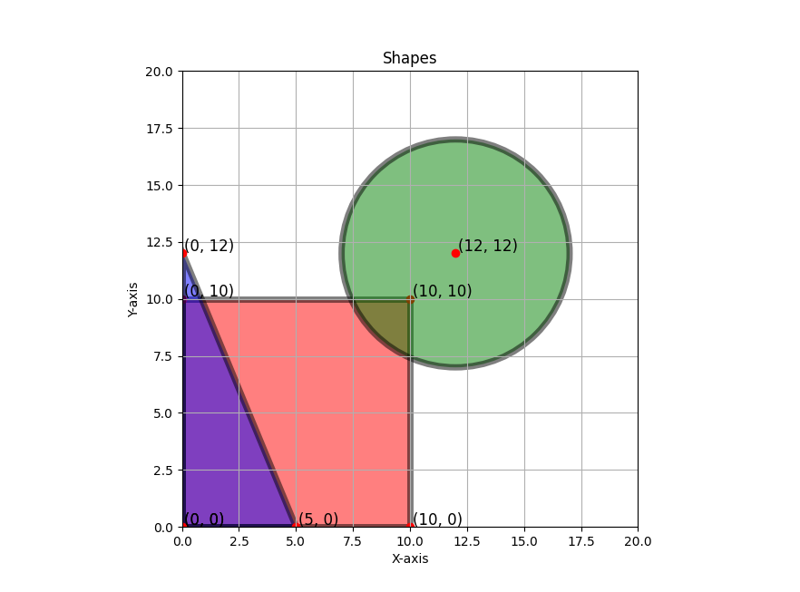

# shapes2D
This code defines geometric shapes in a 2D space (rectangles, circles and triangles). Every shape has methods for checking point containment, overlaps with other shapes, and visualizing.

